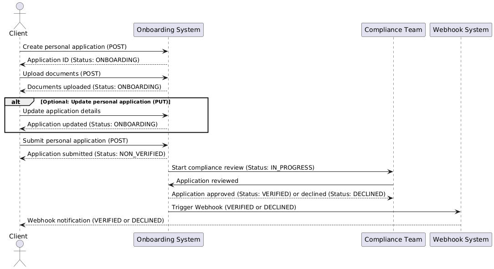

# Partner Onboarding Flow

1. **Create Personal Application**:
    - The client starts by sending a `POST` request to `/onboarding/v1/partner/applications/personal` to create a new personal application.
    - The onboarding system processes the request and responds with an application ID.

2. **Upload Documents**:
    - The client uploads necessary documents (e.g., proof of identity) using `POST /onboarding/v1/partner/applications/personal/{id}/documents`.
    - The onboarding system acknowledges the document upload and stores them for verification.

3. **Optional: Update Personal Application**:
    - Before submitting the application, the client has the option to update the personal application details using `PUT /onboarding/v1/partner/applications/personal/{id}`.
    - The onboarding system processes the update and returns a success message.

4. **Submit Personal Application**:
    - Once all necessary details and documents are provided, the client submits the application using `POST /onboarding/v1/partner/applications/personal/{id}/submit`.
    - The onboarding system marks the application as submitted and begins the verification process.

5. **Optional: Register Webhook**:
    - The client can optionally register a webhook using `POST /onboarding/v1/partner/webhooks` to receive updates on the application status.
    - The webhook system acknowledges the registration and will send updates as needed.

6. **Check Application Status**:
    - The client can periodically check the status of the application by sending a `GET` request to `/onboarding/v1/partner/applications/personal/{id}`.
    - The onboarding system responds with the current application status (e.g., verifying, approved, declined).

7. **Optional: Webhook Updates**:
    - If a webhook was registered, the webhook system sends status updates to the client whenever there is a change in the application's progress.

