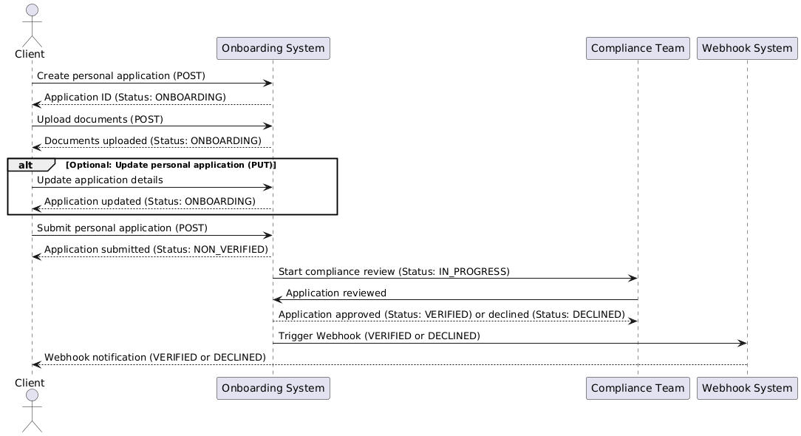

# Partner Onboarding Flow

1. **Create Personal Application**:
   - The client sends a `POST` request to `/onboarding/v1/partner/applications/personal` to create a new personal application.
   - The application status is set to **ONBOARDING**.

2. **Upload Documents**:
   - The client uploads required documents using `POST /onboarding/v1/partner/applications/personal/{id}/documents`.
   - The application remains in the **ONBOARDING** status until submission. This means the status stays **ONBOARDING** until all the required documents are uploaded, and the application is submitted.

3. **Optional: Update Personal Application**:
   - The client can update the personal application (if not submitted yet) using `PUT /onboarding/v1/partner/applications/personal/{id}`.
   - The application remains in the **ONBOARDING** status.

4. **Submit Application for Review**:
   - After uploading all documents and completing all required fields, the client submits the application using `POST /onboarding/v1/partner/applications/personal/{id}/submit`.
   - The application status changes to **NON_VERIFIED** — the application is complete but not yet reviewed by the compliance team.

5. **Compliance Review**:
   - The application may either stay in the **NON_VERIFIED** status while being reviewed by the compliance team, or it may optionally transition to **IN_PROGRESS** (used by Compliance to track ongoing reviews). The **IN_PROGRESS** status is not required, and Compliance can directly transition the application to **VERIFIED** without marking it as **IN_PROGRESS**.

6. **Final Status (VERIFIED or DECLINED)**:
   - If the compliance team approves the application, it transitions to **VERIFIED**.
   - If the application fails compliance, it transitions to **DECLINED**.

7. **Webhook Notification**:
   - Upon transitioning to **VERIFIED** or **DECLINED**, a registered Webhook is triggered to notify the client.
   - If the application is **VERIFIED**, the Webhook payload includes wallet information (`walletId` and `currencyCode`).
   - If **DECLINED**, the Webhook contains the status but no wallet information.

### Webhook Payload:

When the application is **VERIFIED**:
```json
{
  "id": "60b8d295f1d3c72d9c1e5a5e",
  "partnerId": "507f1f77bcf86cd799439011",
  "applicationId": "abcdef1234567890abcdef12",
  "status": "VERIFIED",
  "wallet": {
    "id": "543245545452",
    "currencyCode": "EUR"
  }
}
```

When the application is **DECLINED**:
```json
{
  "id": "60b8d295f1d3c72d9c1e5a5e",
  "partnerId": "507f1f77bcf86cd799439011",
  "applicationId": "abcdef1234567890abcdef12",
  "status": "DECLINED"
}
```
- **id**:
   - The unique identifier for the Webhook notification. This represents the specific event that triggered the Webhook.

- **partnerId**:
   - The ID of the partner (the company). The partner is the entity responsible for registering new customers using the API. Each partner is a business or organization using this onboarding system.

- **applicationId**:
   - The ID of the personal application being submitted. This represents the form or application of the new customer who is being registered by the partner.

- **status**:
   - The current status of the application. It can be either **VERIFIED** (approved by Compliance) or **DECLINED** (rejected by Compliance).

- **wallet**:
   - If the application is **VERIFIED**, this field contains the information about the wallet created for the new customer. The `wallet.id` is the identifier of the wallet, and `currencyCode` specifies the currency (e.g., USD).
   - If the application is **DECLINED**, this field will be absent because no wallet is created.


---
**UML Diagram**

