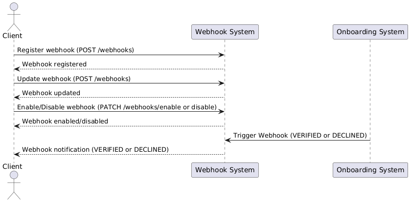

# Webhook Flow

1. **Register Webhook**:
    - The client (partner) registers a webhook using `POST /onboarding/v1/partner/webhooks`.
    - The webhook is set up to receive notifications regarding application status changes (e.g., **VERIFIED** or **DECLINED**).

2. **Update Webhook**:
    - The client can update the webhook by sending another `POST` request to the same endpoint, changing details like the callback URL.

3. **Enable/Disable Webhook**:
    - The client can enable or disable the webhook by sending a `PATCH` request to `PATCH /onboarding/v1/partner/webhooks/enable` or `PATCH /onboarding/v1/partner/webhooks/disable`.
    - This can be used to temporarily stop or restart receiving notifications.

4. **Triggering the Webhook**:
    - When an application transitions to **VERIFIED** or **DECLINED**, the **Onboarding System** triggers the registered webhook.
    - The system sends an HTTP `POST` request to the client's webhook URL with a payload containing details such as `applicationId`, `partnerId`, and the status of the application (either **VERIFIED** or **DECLINED**).

5. **Webhook Payload**:
    - If the status is **VERIFIED**, the payload includes wallet information (`walletId` and `currencyCode`).
    - If the status is **DECLINED**, the wallet information is `null`.

### Webhook Payload:

When the application is **VERIFIED**:
```json
{
  "id": "60b8d295f1d3c72d9c1e5a5e",
  "partnerId": "507f1f77bcf86cd799439011",
  "applicationId": "abcdef1234567890abcdef12",
  "status": "VERIFIED",
  "wallet": {
    "id": "543245545452",
    "currencyCode": "EUR"
  }
}
```

When the application is **DECLINED**:
```json
{
  "id": "60b8d295f1d3c72d9c1e5a5e",
  "partnerId": "507f1f77bcf86cd799439011",
  "applicationId": "abcdef1234567890abcdef12",
  "status": "DECLINED"
}
```
- **id**:
    - The unique identifier for the Webhook notification. This represents the specific event that triggered the Webhook.

- **partnerId**:
    - The ID of the partner (the company). The partner is the entity responsible for registering new customers using the API. Each partner is a business or organization using this onboarding system.

- **applicationId**:
    - The ID of the personal application being submitted. This represents the form or application of the new customer who is being registered by the partner.

- **status**:
    - The current status of the application. It can be either **VERIFIED** (approved by Compliance) or **DECLINED** (rejected by Compliance).

- **wallet**:
    - If the application is **VERIFIED**, this field contains the information about the wallet created for the new customer. The `wallet.id` is the identifier of the wallet, and `currencyCode` specifies the currency (e.g., USD).
    - If the application is **DECLINED**, this field will be absent because no wallet is created.

---
**UML Diagram**

