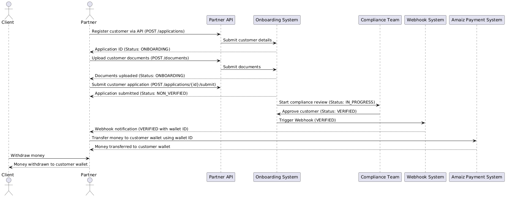

# Money Withdrawal Business Process for Partner API Integration

1. **Partner Registration with Amaiz**:
    - A partner company (already onboarded by Amaiz) receives the required **API credentials** — an access token and a secret key.
    - These credentials allow the partner to make authenticated API requests through the **Partner API**.

2. **Customer Registration**:
    - The partner company has customers (individuals) who want to withdraw money.
    - The customer will trigger the process by clicking a withdrawal button on the partner’s website or platform, e.g., "Withdraw via Amaiz."
    - The partner uses the **Partner API** to register this customer by submitting the customer’s personal details via the onboarding endpoint.
    - The partner also uploads the necessary documents for compliance (e.g., proof of identity, proof of address).

3. **KYC and Compliance Verification**:
    - Once the customer’s application is submitted, Amaiz performs **KYC** (Know Your Customer) checks.
    - The customer’s application status starts as **Non-Verified** and moves to **In Progress** during the review.
    - After the compliance review, the status changes to **Verified** if the customer passes all checks.

4. **Customer Wallet Creation**:
    - After the customer is verified, Amaiz automatically creates a wallet for the customer.
    - The wallet is assigned a unique **12-digit ID** with a starting balance of zero.

5. **Webhook Notification to the Partner**:
    - When the customer’s status changes to **Verified**, the registered Webhook is triggered.
    - The partner receives the Webhook payload, which includes:
        - `partnerId`: ID of the partner company
        - `applicationId`: ID of the customer application
        - `status`: **VERIFIED** (indicating that the customer is verified)
        - `walletId`: Unique 12-digit wallet ID for the customer.

6. **Money Transfer Process**:
    - The partner checks their internal platform and identifies that the customer has been verified via the Webhook notification.
    - The partner can now initiate a transfer using **internal Amaiz payment systems**.
    - The partner transfers the requested amount from their balance (e.g., EUR account) to the customer’s wallet using the **wallet ID** provided in the Webhook.
    - Once the money is transferred, the customer will see the funds in their Amaiz wallet, ready for withdrawal.

7. **Withdrawal Completion**:
    - The funds are now available for the customer to withdraw from their Amaiz wallet.
    - This completes the money withdrawal flow, facilitated by the partner company using the Amaiz API.

### Webhook Payload:

When the application is **VERIFIED**:
```json
{
  "id": "60b8d295f1d3c72d9c1e5a5e",
  "partnerId": "507f1f77bcf86cd799439011",
  "applicationId": "abcdef1234567890abcdef12",
  "status": "VERIFIED",
  "wallet": {
    "id": "543245545452",
    "currencyCode": "EUR"
  }
}
```

When the application is **DECLINED**:
```json
{
  "id": "60b8d295f1d3c72d9c1e5a5e",
  "partnerId": "507f1f77bcf86cd799439011",
  "applicationId": "abcdef1234567890abcdef12",
  "status": "DECLINED"
}
```
- **id**:
    - The unique identifier for the Webhook notification. This represents the specific event that triggered the Webhook.

- **partnerId**:
    - The ID of the partner (the company). The partner is the entity responsible for registering new customers using the API. Each partner is a business or organization using this onboarding system.

- **applicationId**:
    - The ID of the personal application being submitted. This represents the form or application of the new customer who is being registered by the partner.

- **status**:
    - The current status of the application. It can be either **VERIFIED** (approved by Compliance) or **DECLINED** (rejected by Compliance).

- **wallet**:
    - If the application is **VERIFIED**, this field contains the information about the wallet created for the new customer. The `wallet.id` is the identifier of the wallet, and `currencyCode` specifies the currency (e.g., USD).
    - If the application is **DECLINED**, this field will be absent because no wallet is created.

---
**UML Diagram**



1. **Client**:
    - The individual customer on the partner’s platform initiates the withdrawal process

2. **Partner**:
    - The partner company integrates with Amaiz’s Partner API to register the customer, verify their identity, and facilitate the transfer of funds to the customer’s wallet.

3. **Onboarding System**:
    - The Amaiz Onboarding System handles the registration process for the customer. This system receives the customer’s personal information and submitted documents via the Partner API.

4. **Compliance Team**:
    - The Amaiz compliance team reviews the submitted customer application and documents as part of the **KYC** (Know Your Customer) process.
    - If the customer passes verification, the application status is updated to **VERIFIED**. If they do not pass, the status is updated to **DECLINED**.

5. **Webhook System**:
    - Once the customer’s application is processed, the Webhook System sends a notification to the partner company. This notification includes details such as the **wallet ID** and the application status (either **VERIFIED** or **DECLINED**).

6. **Amaiz Payment System**:
    - The partner company transfers the requested funds from their internal Amaiz balance (e.g., a EUR account) to the customer’s wallet using the wallet ID provided in the webhook notification.
    - After the funds are transferred, they become available in the customer’s Amaiz wallet, and the customer can proceed with the withdrawal process.